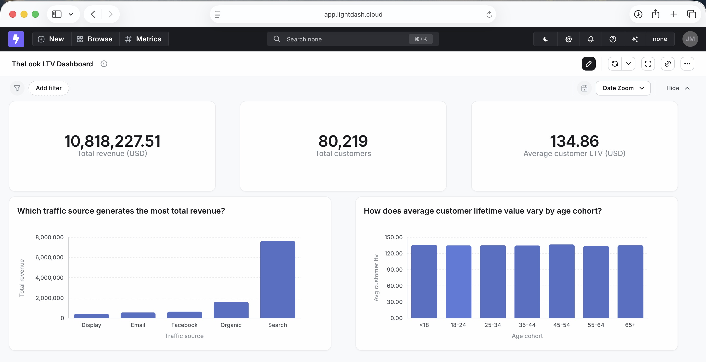
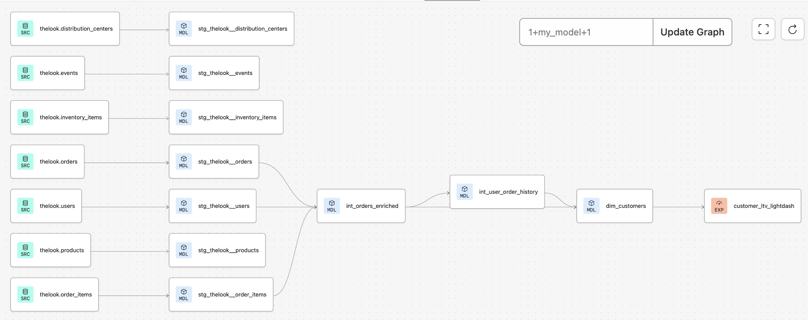

# E-Commerce Customer Analytics (dbt Portfolio Project)

A dbt project demonstrating analytics engineering best practices using BigQuery's `thelook_ecommerce` public dataset. This project transforms raw e-commerce data into analysis-ready customer dimensions with lifetime value metrics.

## Project Overview

This project builds a customer dimension that enables analysis of customer lifetime value across different segments.

**Business questions this enables:**
- Which acquisition channels generate the most revenue?
- How does average customer lifetime value vary by age demographic?

The final mart (`dim_customers`) is connected to Lightdash with metrics defined in dbt YAML, demonstrating the full analytics engineering workflow from raw data to BI layer.

## Architecture
```
Sources (BigQuery public data)
    ↓
Staging (cleaning, type casting, renaming)
    ↓
Intermediate (joins, business logic)
    ↓
Marts (business-facing dimensions)
    ↓
BI Layer (Lightdash)
```

**Why this structure?**
- **Staging models** are the single source of truth for raw data - all cleaning happens once, here
- **Intermediate models** handle complex joins and transformations that shouldn't clutter marts
- **Marts** are clean, documented data products ready for analysts and BI tools

## Data Model

### dim_customers
Customer dimension combining demographic attributes with lifetime value metrics.

| Column | Description |
|--------|-------------|
| user_id | Primary key |
| country, state, city | Geography from first order |
| traffic_source | Acquisition channel |
| age_cohort | Demographic band (e.g., 25-34) |
| lifetime_order_count | Total orders placed |
| lifetime_order_value | Total revenue from customer |
| avg_order_value | Average order value |
| first_order_at | Acquisition date |
| most_recent_order_at | Last activity date |

## Key Design Decisions

### PII Handling
- **Excluded email** from downstream models - this data product could surface to users who shouldn't have PII access
- **Transformed age into cohorts** rather than exposing raw ages, preserving analytical value while protecting privacy

### Data Type Precision
- **Cast monetary values to NUMERIC in staging** rather than using FLOAT64. Floating-point arithmetic can introduce rounding errors (the classic 0.1 + 0.2 ≠ 0.3 problem). While negligible for most analytics, finance teams expect precision - even small discrepancies erode trust in data products.

### Customer Dimension Design
- **Captured attributes from first order** (geography, traffic source, age cohort) using `qualify row_number() over (partition by user_id order by created_at) = 1`. This gives stable customer attributes for cohort analysis rather than values that shift with each order.

### Testing Strategy
- **Staging tests** - uniqueness, not-null on primary keys, and relationship tests to validate foreign keys against source data
- **Mart tests** - primary keys and not-null constraints on fields critical to business logic, where I control the transformations

### Documentation
Documented both staging and marts with column descriptions and tests to ensure clarity for downstream consumers.

## Tools

- **dbt Cloud** - transformation and orchestration
- **BigQuery** - data warehouse
- **GitHub** - version control with feature branch workflow
- **Lightdash** - BI layer with semantic metrics defined in YAML

### Lightdash Dashboard



## DAG



## Project Structure
```
models/
├── staging/
│   └── thelook/
│       ├── _thelook__sources.yml
│       ├── stg_thelook__orders.sql
│       ├── stg_thelook__orders.yml
│       ├── stg_thelook__users.sql
│       ├── stg_thelook__users.yml
│       └── ...
├── intermediate/
│   ├── _int_models.yml
│   ├── int_orders_enriched.sql
│   └── int_user_order_history.sql
└── marts/
    └── thelook/
        ├── dim_customers.sql
        ├── dim_customers.yml
        └── _marts_exposures.yml
```

## Local Development

This project uses dbt Cloud, but can be run locally with dbt Core:
```bash
# Clone the repo
git clone https://github.com/joanne42moore/dbt-portfolio.git

# Install dbt with BigQuery adapter
pip install dbt-bigquery

# Set up profiles.yml with your BigQuery credentials

# Run the project
dbt build
```
