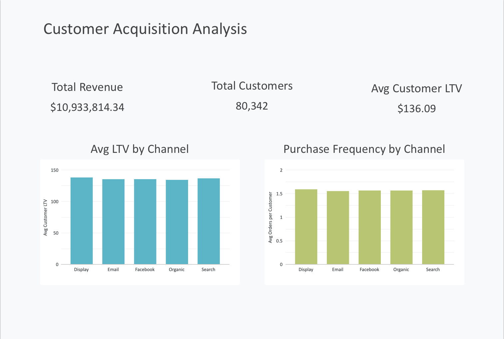
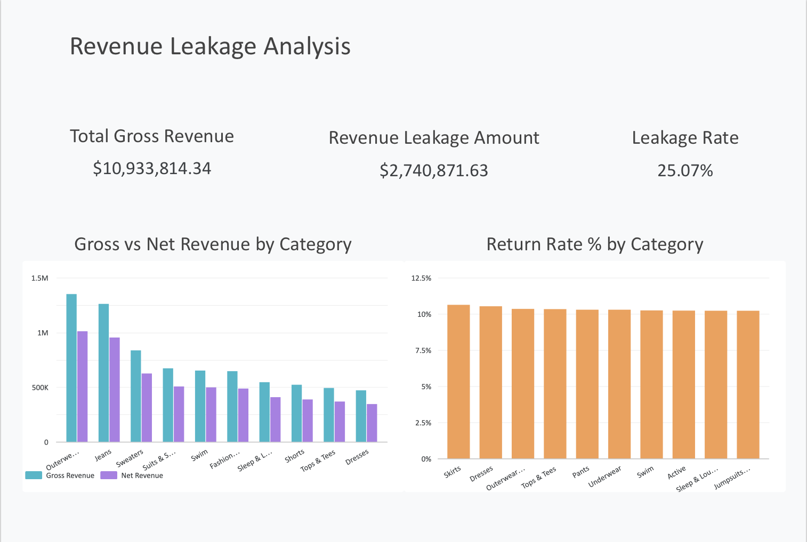
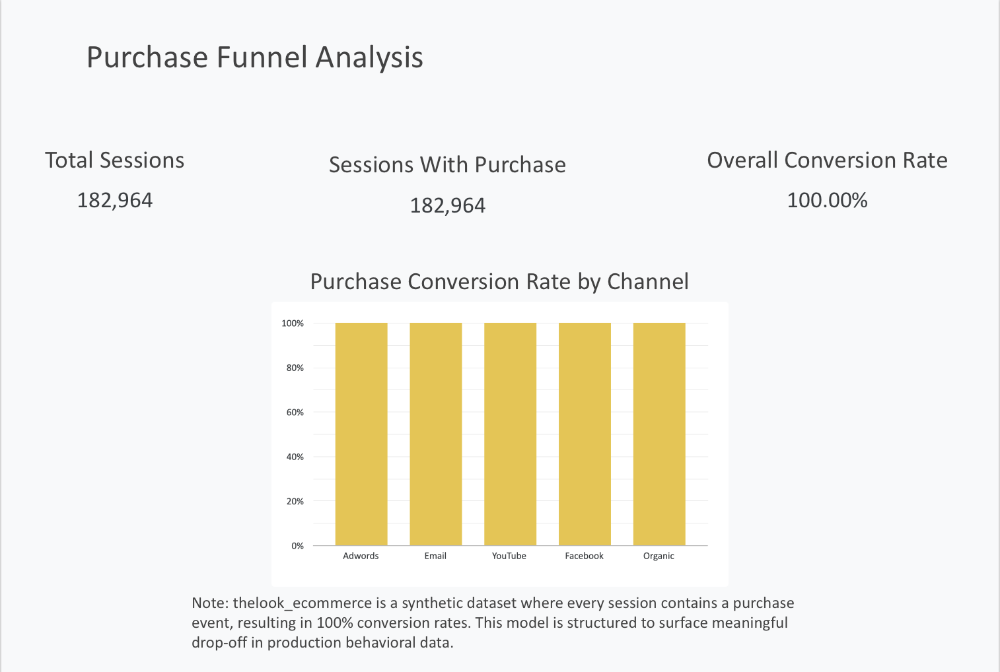
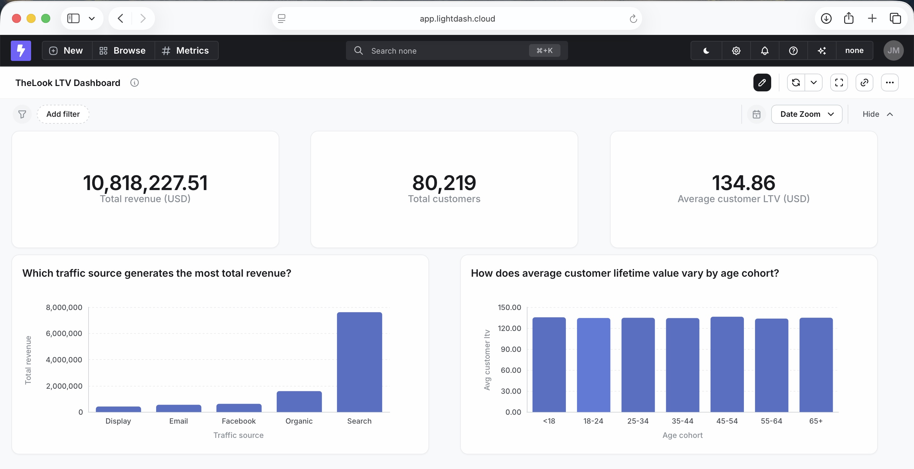
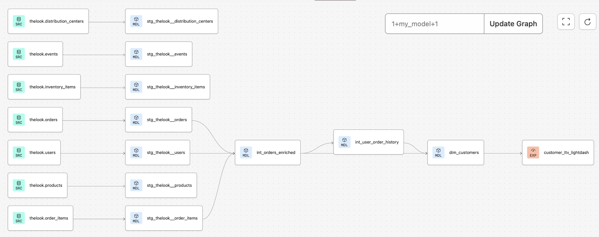

# E-Commerce Analytics Portfolio | dbt + BigQuery + Looker Studio

A dbt project demonstrating both analytics engineering best practices and business-narrative data analysis. Built on BigQuery's thelook_ecommerce public dataset, this project transforms raw e-commerce data into analysis-ready models and answers three core business questions.

**Live Dashboard:** [TheLook E-Commerce Analytics](https://lookerstudio.google.com/s/gzko28qHDOo)

## Business Analyses

### 1. Customer Acquisition Value

**Question:** Which acquisition channels generate the most valuable customers?

**Finding:** Across 80,342 customers and $10.9M in revenue, acquisition channels show similar LTV (~$136) and purchase frequency (~1.6 orders per customer), consistent with synthetic data generation patterns. The model is structured to surface channel differentiation in production data.

**Models used:** dim_customers



### 2. Revenue Leakage

**Question:** Where is revenue leaking through returns and cancellations?

**Finding:** $2.7M of $10.9M gross revenue (25%) is lost to returns and cancellations. Outerwear and Jeans carry the highest absolute leakage due to revenue volume, making them priority categories for return reduction initiatives.

**Models used:** fct_order_items



### 3. Purchase Funnel

**Question:** How do customers move through the purchase funnel by acquisition channel?

**Finding:** Session-level funnel analysis built on 182,964 sessions across five traffic sources. Note: thelook_ecommerce is a synthetic dataset where every session contains a purchase event, resulting in 100% conversion rates. The model is structured to surface meaningful drop-off in production behavioral data.

**Models used:** int_session_funnel



## Architecture

```
Sources (BigQuery public data)
    ↓
Staging (cleaning, type casting, renaming)
    ↓
Intermediate (joins, business logic)
    ↓
Marts (business-facing dimensions)
    ↓
BI Layer (Looker Studio / Lightdash)
```

**Why this structure?**
- **Staging models** are the single source of truth for raw data - all cleaning happens once, here
- **Intermediate models** handle complex joins and transformations that shouldn't clutter marts
- **Marts** are clean, documented data products ready for analysts and BI tools

## Data Model

### dim_customers

Customer dimension combining demographic attributes with lifetime value metrics.

| Column | Description |
|--------|-------------|
| user_id | Primary key |
| country, state, city | Geography from first order |
| traffic_source | Acquisition channel |
| age_cohort | Demographic band (e.g., 25-34) |
| lifetime_order_count | Total orders placed |
| lifetime_order_value | Total revenue from customer |
| avg_order_value | Average order value |
| first_order_at | Acquisition date |
| most_recent_order_at | Last activity date |

## Key Design Decisions

### PII Handling
- **Excluded email** from downstream models - this data product could surface to users who shouldn't have PII access
- **Transformed age into cohorts** rather than exposing raw ages, preserving analytical value while protecting privacy

### Data Type Precision
- **Cast monetary values to NUMERIC in staging** rather than using FLOAT64. Floating-point arithmetic can introduce rounding errors (the classic 0.1 + 0.2 ≠ 0.3 problem). While negligible for most analytics, finance teams expect precision - even small discrepancies erode trust in data products.

### Customer Dimension Design
- **Captured attributes from first order** (geography, traffic source, age cohort) using `qualify row_number() over (partition by user_id order by created_at) = 1`. This gives stable customer attributes for cohort analysis rather than values that shift with each order.

### Testing Strategy
- **Staging tests** - uniqueness, not-null on primary keys, and relationship tests to validate foreign keys against source data
- **Mart tests** - primary keys and not-null constraints on fields critical to business logic, where I control the transformations

### Documentation
Documented both staging and marts with column descriptions and tests to ensure clarity for downstream consumers.

## Tools

- **dbt Cloud** - transformation and orchestration
- **BigQuery** - data warehouse
- **GitHub** - version control with feature branch workflow
- **Lightdash** - BI layer with semantic metrics defined in YAML
- **Looker Studio** - business intelligence and dashboards
- **Cursor** - AI-assisted IDE for development

### Lightdash Dashboard



## DAG



## Project Structure

```
analyses/
├── narrative_1_clv_by_channel.sql
├── narrative_2_revenue_leakage.sql
└── narrative_3_purchase_funnel.sql

macros/
├── age_cohort_bucket.sql
└── cast_dollars.sql

models/
├── staging/
│   └── thelook/
│       ├── _sources_thelook.yml
│       ├── stg_thelook__distribution_centers.sql
│       ├── stg_thelook__distribution_centers.yml
│       ├── stg_thelook__events.sql
│       ├── stg_thelook__events.yml
│       ├── stg_thelook__inventory_items.sql
│       ├── stg_thelook__inventory_items.yml
│       ├── stg_thelook__order_items.sql
│       ├── stg_thelook__order_items.yml
│       ├── stg_thelook__orders.sql
│       ├── stg_thelook__orders.yml
│       ├── stg_thelook__products.sql
│       ├── stg_thelook__products.yml
│       ├── stg_thelook__users.sql
│       └── stg_thelook__users.yml
├── intermediate/
│   └── thelook/
│       ├── _int_models.yml
│       ├── int_orders_enriched.sql
│       ├── int_session_funnel.sql
│       └── int_user_order_history.sql
└── marts/
    └── thelook/
        ├── _marts_exposures.yml
        ├── dim_customers.sql
        ├── dim_customers.yml
        ├── fct_order_items.sql
        └── fct_order_items.yml
```

## Local Development

This project uses dbt Cloud, but can be run locally with dbt Core:

```bash
# Clone the repo
git clone https://github.com/joanne42moore/dbt-portfolio.git

# Install dbt with BigQuery adapter
pip install dbt-bigquery

# Set up profiles.yml with your BigQuery credentials

# Run the project
dbt build
```
